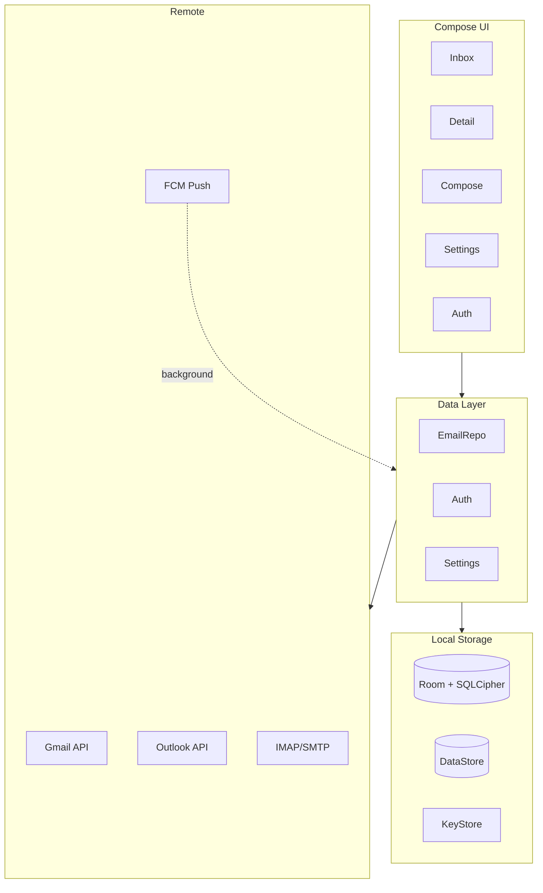

# MonoMail

[](https://github.com/shrivatsav-org/monomail/releases/latest)
[](LICENSE)
[](https://developer.android.com/about/versions/8.0)
[](https://kotlinlang.org)
[](https://discord.gg/gXp6xPetKU)
[](https://ko-fi.com/N4N2W53M5)

Monochrome email client for Android — Jetpack Compose, Material 3 Expressive. No colour accents, no noise, just email.

[Website](https://monomail.millosaurs.me) · [Download from Play Store](https://play.google.com/store/apps/details?id=com.shrivatsav.monomail) · [Discord](https://discord.gg/gXp6xPetKU)

> [!NOTE]
> **Play Store Version:** The app is currently in **Open Testing** on the Google Play Store (Paid). It includes full support for the **Gmail API** with instant **Push Notifications**, Microsoft Graph for Outlook, and IMAP.

> [!IMPORTANT]
> **Help Make Gmail Support Free:** We are actively collecting funds to cover the expensive **Google CASA Security Assessment** required to verify the app and make Gmail API access free for everyone. If you'd like to support this effort, please consider donating on [Ko-fi](https://ko-fi.com/N4N2W53M5)!

---

## Features
### Inbox
- **Navigation**: Pull-to-refresh, paginated scroll, scroll position retention per tab.
- **Actions**: Swipe gestures (configurable L/R), long-press actions, bulk multi-select, undo toast (4s), mark-all-read.
- **Organization**: Smart sender grouping, snooze (1hr/tomorrow/weekend/next week), date headers, calendar badge for scheduled.

### Conversation & Detail View
- **Threading**: Collapsible thread view, inline chain view (configurable), thread connecting lines, alternating backgrounds, CC/BCC expand.
- **Rendering**: HTML rendering (WebView, JS disabled), algorithmic dark mode (AndroidX WebKit), responsive email detection.
- **Security & Privacy**: Remote image blocking with per-email override, CSP `default-src 'none'`, HTML sanitization (no Jsoup).
- **Viewing**: Collapsible quoted text, inline image previews (max 280dp), attachment grid (2-4 columns), font scaling (0.8x-1.3x).

### Search
- **Local**: Client-side filter (subject/sender/snippet).
- **Remote**: Server-side API search with pagination.

### Multi-Account & Push Notifications
- **Accounts**: Up to 10 accounts (Gmail, Outlook, IMAP).
- **Interface**: Unified inbox toggle, swipe-to-switch avatar, profile card.
- **Push**: Instant Gmail Pub/Sub push notifications, Outlook Webhooks, and IMAP IDLE support. No more battery-draining polling—messages arrive the second they are sent.

### Compose
- **Basics**: Reply/Reply-all/forward, CC/BCC, contact autocomplete, file attachments (any MIME).
- **Advanced**: Schedule send, undo send (5-30s configurable), send-as aliases, email templates.
- **Editor**: WebView contenteditable editor with formatting toolbar (B/I/U/lists/quote).

### PGP Security
- **Key Management**: Ed25519/X25519 key generation, ASCII-armored import/export, passphrase-protected keys.
- **Operations**: Auto-decrypt + signature verification, encrypt & sign on outgoing.

### Settings & Notifications
- **Customization**:
  - *Appearance*: Theme, font scale, dividers, compact mode, remote images, markdown, email colors.
  - *Inbox*: Swipe config, smart grouping.
  - *Compose*: Reply mode, confirm-send, undo window, templates.
  - *Navigation*: Dock size, tab editor.
- **Background Sync**: Adaptive WorkManager sync (2min foreground, 15min backoff), parallelized multi-account sync.
- **Alerts**: Per-account channels (sound/vibration), inline reply via RemoteInput, archive+undo from shade.

### Micro-interactions
- **Physics**: Spring physics throughout (press-scale on cards/buttons, animated dock tabs, bounce on theme selector).
- **Motion**: `animateContentSize` for expand/collapse, sent overlay animation, slide+fade navigation transitions.

### Extreme Optimizations

- **Zero-Polling Battery Life**: By moving to a Cloudflare Worker backend for Gmail Pub/Sub and Outlook Webhooks, combined with IMAP IDLE, the app sleeps until a push message wakes it up via FCM. Zero polling means minimal battery consumption.
- **Compose Render Performance**: Heavy use of `remember`, `derivedStateOf`, and immutable data classes to skip recompositions. List scrolling hits strict 120fps via lazy rendering and item keying.
- **Database & Local Caching**: SQLCipher + Room queries are heavily parallelized. We use adaptive paginated fetching with intelligent local caching so the app works seamlessly offline and loads instantly.
- **Network Efficiency**: Minimized payload sizes, batched API requests, and aggressive GZIP compression for all endpoints. Background sync is offloaded to WorkManager only when necessary, adapting to your network state.

### Account management

- **Gmail** — Android Credential Manager + Google Identity Services
- **Outlook** — MSAL 5.4.0 with silent token refresh
- **IMAP/SMTP** — provider presets (Gmail, Outlook, Yahoo, Zoho, Custom) with connection testing
- AES-GCM encrypted credential storage (Android KeyStore)
- Provider-scoped sign-out

## Architecture



| Layer | Technology |
|---|---|
| UI | Jetpack Compose, Material 3 Expressive, Navigation Compose |
| Language | Kotlin 2.2 |
| DI | Hilt |
| Networking | Retrofit 2, OkHttp 4 |
| Database | Room + SQLCipher |
| Auth | Google Credential Manager, MSAL 5.4.0 |
| IMAP/SMTP | Eclipse Angus Mail (Jakarta Mail 2.x) |
| PGP | PGPainless 2.0.3 (Bouncy Castle) |
| Images | Coil Compose |
| Markdown | Markwon 4.6.2 |
| Background | WorkManager + ActionQueueManager |
| Secure storage | AndroidX Security Crypto |

## Getting Started

### Prerequisites

- Android Studio Ladybug+
- JDK 17+
- Google Cloud project with Gmail API enabled
- Azure App Registration (Outlook/Microsoft Graph — scopes: `Mail.Read`, `Mail.ReadWrite`, `Mail.Send`, `User.Read`; redirect URI: `msal{client_id}://auth`)

### Setup

```bash
git clone https://github.com/shrivatsav-org/monomail.git
```

Create `secrets.properties` for the `playstore` flavor:

```properties
GOOGLE_CLIENT_ID=your_web_client_id_here
```

Configure MSAL (optional — `app/src/main/res/raw/msal_config.json`):

```json
{
  "client_id": "your_msal_client_id",
  "authorities": [{"type": "AAD", "audience": "AzureADandPersonalMicrosoftAccount"}],
  "redirect_uri": "msal{your_client_id}://auth"
}
```

Minimum SDK: 26 (Android 8.0).

### Builds

| Flavor | Description |
|---|---|
| `playstore` | Bundled with the developer's official Google OAuth Web Client ID. Push notifications via FCM. |
| `github` | Excludes private OAuth client ID. Google Sign-In temporarily disabled during OAuth verification — use Outlook or IMAP in the meantime. |

```bash
./gradlew installPlaystoreDebug   # or installGithubDebug
```

## Contributing

PRs welcome. Open an issue first for significant changes.

```
Fork → Branch → Commit → Pull Request
```

## License

[GPL-3.0](LICENSE)

---

Built by [Shrivatsav](https://github.com/shrivatsav-org)
